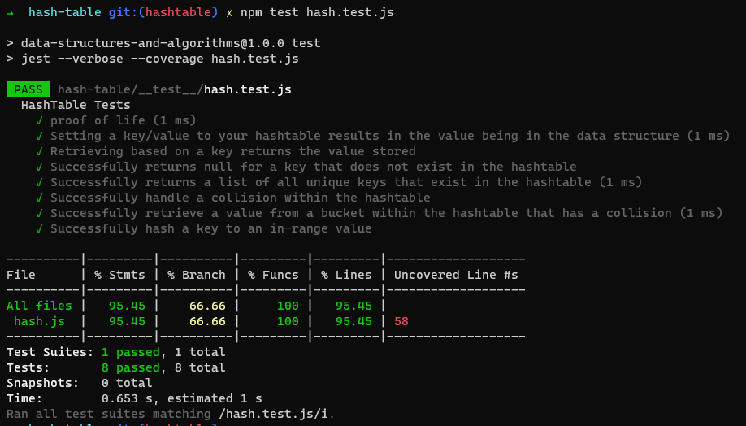

# Hash Table Implementation

Intro to Hash Tables. Use your skills to create a hash table data structure in JavaScript

## Whiteboard Process

`Not required for this lab`

## Approach & Efficiency

Followed along with the lecture with help from Ryan

## Solution

