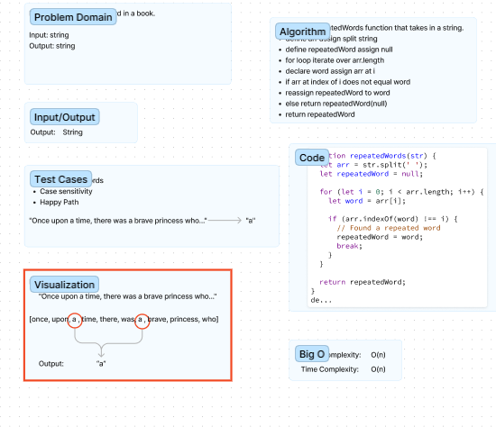
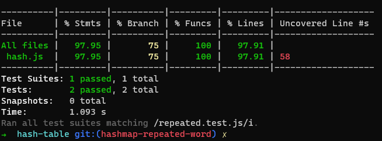

# Hash Table Implementation

Intro to Hash Tables. Use your skills to create a hash table data structure in JavaScript

## Whiteboard Process

`Not required for this lab`

## Approach & Efficiency

Followed along with the lecture with help from Ryan

## Solution

<!-- Code Challenge 31  -->

# Hashmap Repeated Word

Create a function in a Hashmap to determine if a value has repeated words

## Whiteboard Process

Worked with Kaeden and Justin

## Approach & Efficiency

Worked through the algorithm with teamated until we found a solution

## Solution

