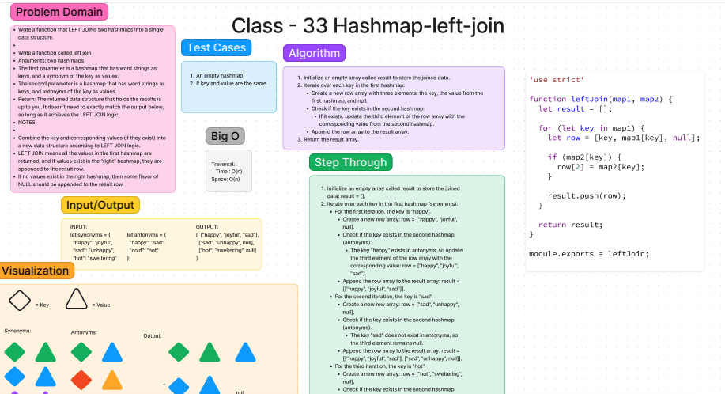

# Hashmap Left

Create a function the takes two hash maps and prints out the an array. If there are two matching keys in the array both values will be put into an array, each key value pair should have an array. The function shoud return an array of arrays.

## Whiteboard Process

## Approach & Efficiency

I participated with my teamates to find a solution

## Solution

`function leftJoin(map1, map2) {
  let result = [];

  for (let key in map1) {
    let row = [key, map1[key], null];

    if (map2[key]) {
      row[2] = map2[key];
    }

    result.push(row);
  }
}`
