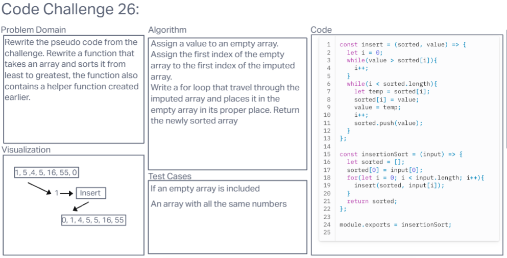

# Insertion Sort

Create a function that sorts an array of number by value.

## Whiteboard Process

I collaberated with Tim and Tricia Sawyer

## Approach & Efficiency

Used the psedo code to piece together the correct code

## Solution

const insert = (sorted, value) => {

  let i = 0;

  while(value > sorted[i]){

    i++;

  }

  while(i < sorted.length){

    let temp = sorted[i];

    sorted[i] = value;

    value = temp;

    i++;

    sorted.push(value);

  }

};

function insertionSort(input){

  let sorted = [];

  sorted[0] = input[0];

  for(let i = 0; i < input.length; i++){

    insert(sorted, input[i]);

  }
  
  return sorted;

};
