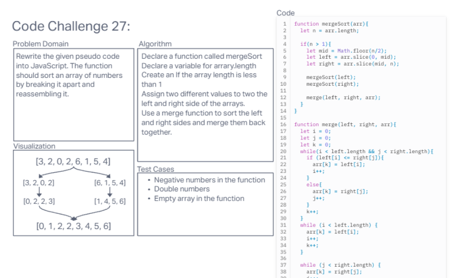
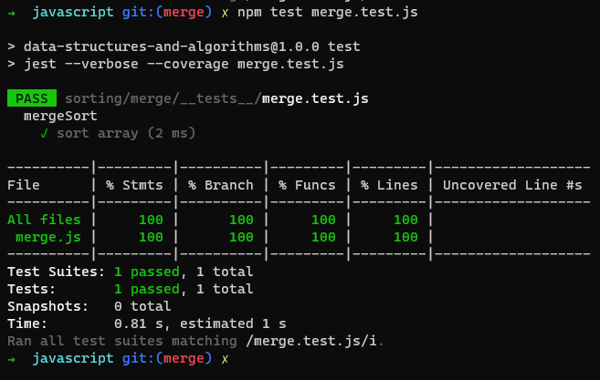

# Merge Sort

Create a function that sorts an array of numbers by spliting it and merging it.

## Whiteboard Process

## Approach & Efficiency

Used the psedo code to piece together the correct code. Tested it in a personal replit.

## Solution

