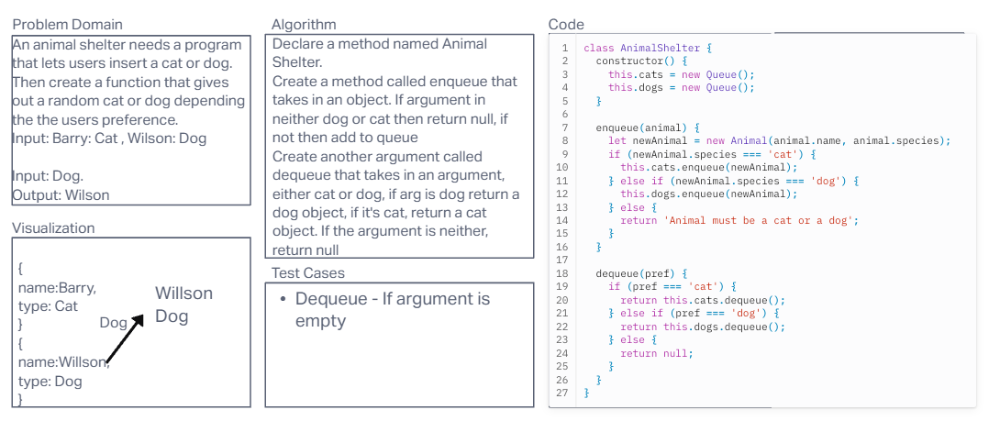

# Animal Shelter

Code Challenge 12 - Stack Queue Animal Shelter Today's assignment is to create a class called AnimalShelter which holds only dogs and cats. The shelter operates using a first-in, first-out approach. I will create a whiteboard for this process and then create a new class called AnimalShelter. I will then create a new instance of the Queue class. I will then create the required methods for the AnimalShelter class. No additional tests need to be written for today's assignment.

## Whiteboard Process

Code Challenge 12

## Approach & Efficiency

I started with a whiteboard of the AnimalShelter implementation. I then created an AnimalShelter class that will use a Queue class. I then created the required methods for the AnimalShelter class. I'll have to plug my methods into Chat GPT to get the Big O space/time for this approach. The following methods will have a Big O space/time complexity:

## Collaboration

Ryan Eastman

## Soulution

I created a new class called Animal in my index.js file.

I created a new class called AnimalShelter in my index.js file.

I created a new instance of the Queue class.

I created the required methods for the AnimalShelter class.
