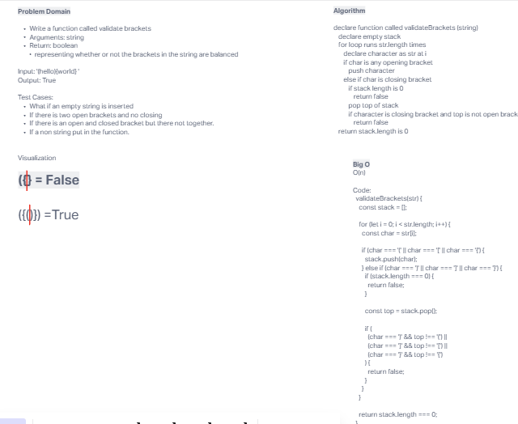
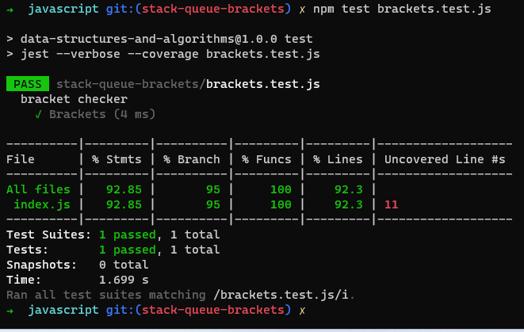

# Stack Queue Brackets

Create a function to can tell whether a string has a complete set of brackets

## Whiteboard Process

 Collaborated  with Josh Coffey

## Approach & Efficiency

We collaborated and worked through possible solutions until we reached the correct answer

## Solution

