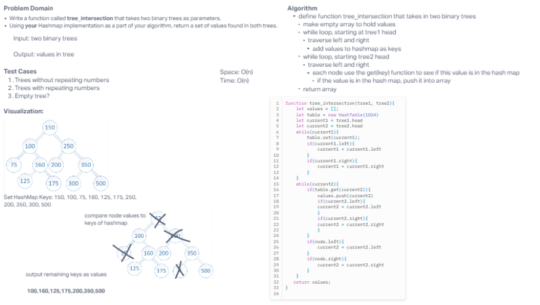

# Tree Intersection

Create a function to see if two trees have matching nodes using hashmap functions

## Whiteboard Process

## Approach & Efficiency

Reviewed the hashmap and binary tree data structure methods and combined some aspects of both the find a solution to this problem

## Solution

