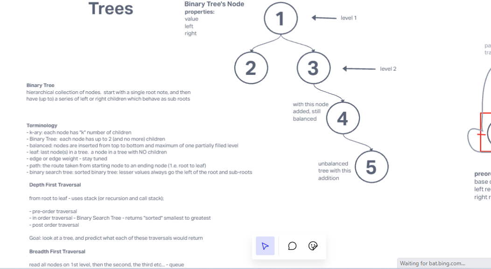
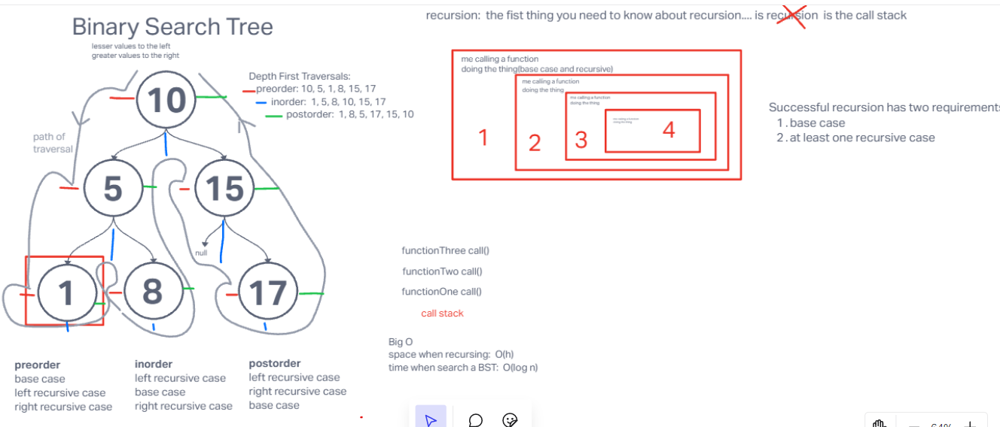
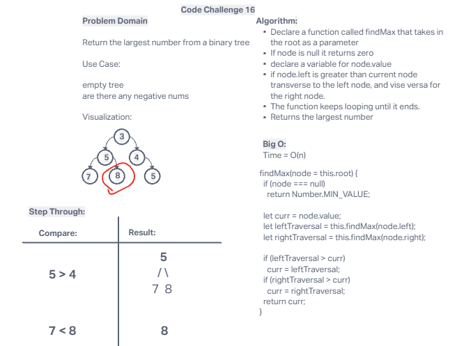

# Binary Trees

The intro to the binary tree structure.

(Max Tree): Create a method in the tree to find the largest number

## Whiteboard Process

Collaborated referenced from fridays lecture

### MaxTree Whiteboard

Josh Coffey

## Approach & Efficiency

Used info from the lecture to make the base functions. Added the extra from trial and error

We collaborated to find the solution using notes from the previous challenge.
